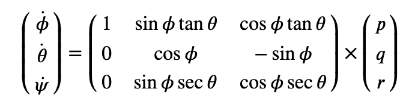
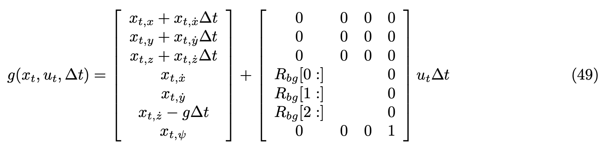
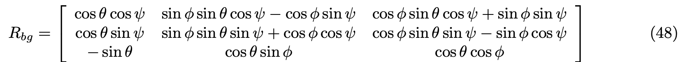
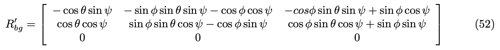
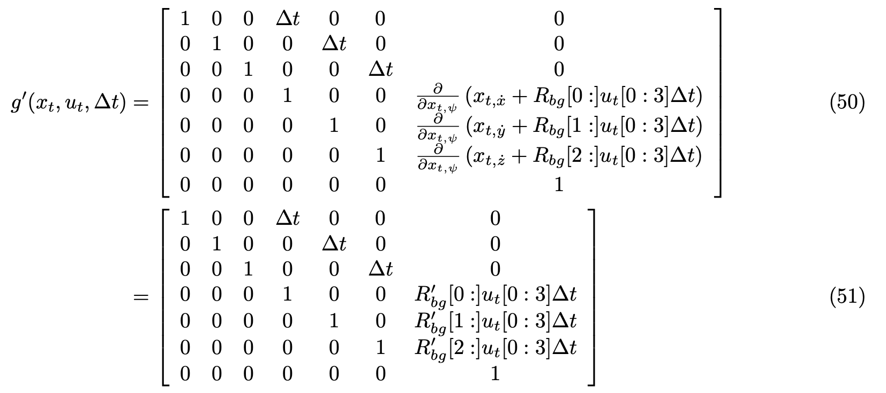
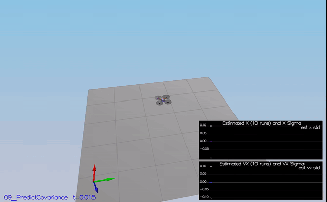
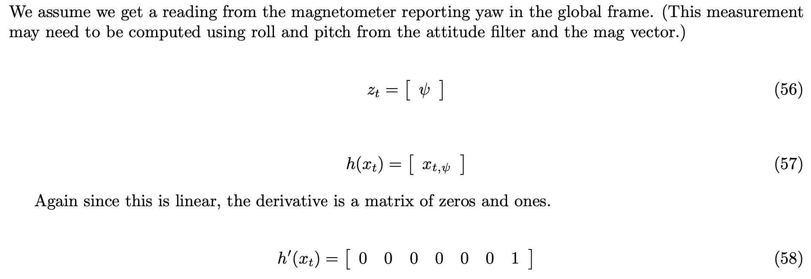
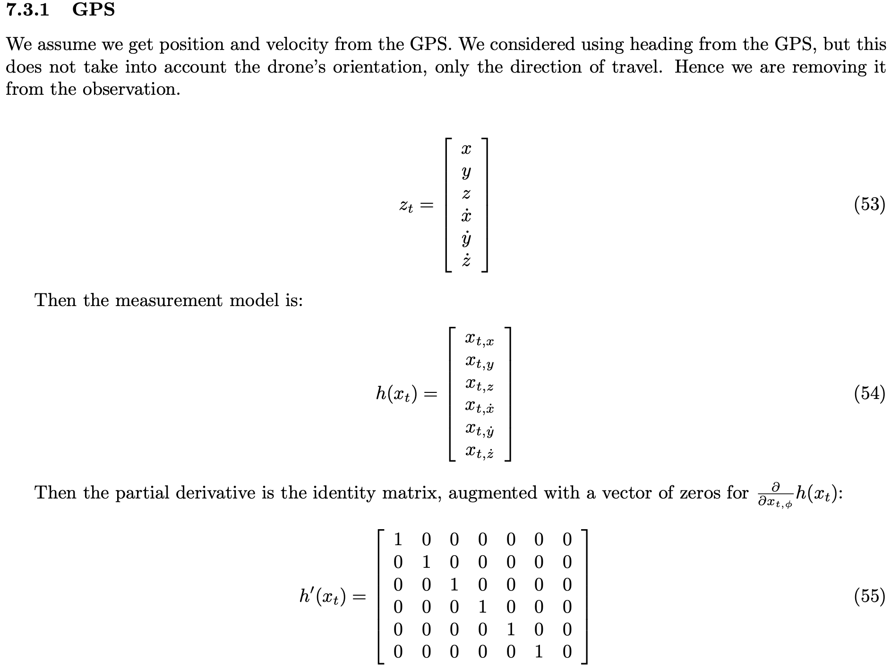

# Estimation Project #


In this project, I implement a 3D estimation technique for quadrotors using Extended Kalman Filter(EKF). In the previous project, Control of a 3D Quadrotor, the drone is controled with no noise. But the reality is we need to estimate current position of drone, velocity and yaw. All the maths used in the project can be found in the paper [Estimation for Quadrotors](https://www.overleaf.com/project/5c34caab7ecefc04087273b9).

[Detailed Project Explantion Page from Udacity](https://github.com/udacity/FCND-Estimation-CPP).


## Setup ##

This project will continue to use the C++ development environment you set up in the Controls C++ project.

 1. Clone the repository
 ```
 git clone https://github.com/udacity/FCND-Estimation-CPP.git
 ```

 2. Import the code into your IDE like done in the [Controls C++ project](https://github.com/udacity/FCND-Controls-CPP#development-environment-setup)
 
 3. You should now be able to compile and run the estimation simulator just as you did in the controls project

## Project Structure ##

Most of the code provided is the drone simulator. The following files where are the the main files need to complete:

* [/src/QuadEstimatorEKF.cpp](./src/QuadEstimatorEKF.cpp): The Extended Kalman Filter for state estimation is implemented in this file.
* [/src/QuadControl.cpp](./src/QuadControl.cpp): The cascade PID control implemented in this file. This is implemented on the previous project, Control of a 3D Quadrotor.
* [/config/QuadEstimatorEKF.txt](./config/QuadEstimatorEKF.txt): Parameters for tuning the EKF are in this parameter file.
* [/config/QuadControlParams.txt](./config/QuadControlParams.txt): Parameters for the PID control code is in QuadControlParams.txt


## The Tasks ##

I builded up the estimator in pieces. At each step, there were a set of success criteria that were displayed both in the plots and in the terminal output.

Project outline:

 - [Step 1: Sensor Noise](#step-1-sensor-noise)
 - [Step 2: Attitude Estimation](#step-2-attitude-estimation)
 - [Step 3: Prediction Step](#step-3-prediction-step)
 - [Step 4: Magnetometer Update](#step-4-magnetometer-update)
 - [Step 5: Closed Loop + GPS Update](#step-5-closed-loop--gps-update)
 - [Step 6: Adding Your Controller](#step-6-adding-your-controller)


## Step 1: Sensor Noise ##
1. The first step to adding additional realism to the problem, and developing an estimator, is adding noise to the quad's sensors. I ran scenario 06_NoisySensors collected some simulated noisy sensor data. The collected data were saved in [/src/data/Accelerometer.X.Data.txt](./src/data/Accelerometer.X.Data.txt) and [/src/data/GPS.X.Data.txt](./src/data/GPS.X.Data.txt)

2. Then used np.std() to estimate the standard deviation of these data, it was implemented in [/src/sensor_noise.ipynb](./src/sensor_noise.ipynb)
```
GPS X Std: 0.7052766300977962
Accelerometer X Std: 0.5096887953058913
```

3. Plug in the result into the top of `config/6_Sensornoise.txt`.  Set the values for `MeasuredStdDev_GPSPosXY` and `MeasuredStdDev_AccelXY`.

4. Run the simulator. My standard deviation correctly capturing approx 68% of the respective measurements (which is what we expect within +/- 1 sigma bound for a Gaussian noise model)
```
Simulation #2 (../config/06_SensorNoise.txt)
PASS: ABS(Quad.GPS.X-Quad.Pos.X) was less than MeasuredStdDev_GPSPosXY for 68% of the time
PASS: ABS(Quad.IMU.AX-0.000000) was less than MeasuredStdDev_AccelXY for 69% of the time
```

And here is a video of the scenario:


## Step 2: Attitude Estimation ##

The first step to state estimation is including information from our IMU.  In this step, I improved the complementary filter-type attitude filter with a better rate gyro attitude integration scheme.

1. Run scenario `07_AttitudeEstimation`.  For this simulation, the only sensor used is the IMU and noise levels are set to 0 (see `config/07_AttitudeEstimation.txt` for all the settings for this simulation).  There are two plots visible in this simulation.
   - The top graph is showing errors in each of the estimated Euler angles.
   - The bottom shows the true Euler angles and the estimates.
Observe that there’s quite a bit of error in attitude estimation.

2. In `QuadEstimatorEKF.cpp`, the function `UpdateFromIMU()` contains a complementary filter-type attitude filter.  To reduce the errors in the estimated attitude (Euler Angles), I implement a better rate gyro attitude integration scheme.  

Turn rate in the body frame to an change in the Euler angles (world frame) is done with the matrix multiplication.



3. I reduced the attitude errors to get within 0.1 rad for each of the Euler angles, as shown in the screenshot below.
```
Simulation #3 (../config/07_AttitudeEstimation.txt)
PASS: ABS(Quad.Est.E.MaxEuler) was less than 0.100000 for at least 3.000000 seconds
```


In the screenshot above the attitude estimation using linear scheme (left) and using the improved nonlinear scheme (right). Note that Y axis on error is much greater on left.

And here is a video of the scenario:


## Step 3: Prediction Step ##

Run scenario `08_PredictState`.  This scenario is configured to use a perfect IMU (only an IMU). Due to the sensitivity of double-integration to attitude errors, we've made the accelerometer update very insignificant (`QuadEstimatorEKF.attitudeTau = 100`).  The plots on this simulation show element of your estimated state and that of the true state.  At the moment you should see that your estimated state does not follow the true state.

### Fist step: state prediction
   In `QuadEstimatorEKF.cpp`, I implemented the state prediction step in the `PredictState()` functon base on the paper [Estimation for Quadrotors]((https://www.overleaf.com/read/vymfngphcccj).
   
   The state transition function is:

   

   The transition function needs the rotation matrix Rbq which rotates from body frame to global frame, and it is defined below:

   

   I used `attitude.Rotate_BtoI()` to convert the true acceleration from body frame to the global frame.

 
   The estimator state track the actual state, with only reasonably slow drift, as shown in the figure below:

   

### Second Step: update the covariance matrix 
   Now let's introduce a realistic IMU, one with noise.  Run scenario `09_PredictionCov`. You will see a small fleet of quadcopter all using your prediction code to integrate forward. You will see two plots:
   1. The top graph shows 10 (prediction-only) position X estimates
   2. The bottom graph shows 10 (prediction-only) velocity estimates
   You will notice however that the estimated covariance (white bounds) currently do not capture the growing errors.

   In `QuadEstimatorEKF.cpp`, I calculate the partial derivative of the body-to-global rotation matrix in the function `GetRbgPrime()` base on the equation.

   

   Then I implemented the rest of the prediction step (predict the state covariance forward) in `Predict()` base on the the Jacobian of g to perform a linear approximation of the system:

   


   There the dotted line is growing showing sigma growing over time due to the prediction step. Here is a scenario video:

   

## Step 4: Magnetometer Update ##

Up until now we've only used the accelerometer and gyro for our state estimation.  In this step, I added the information from the magnetometer to improve my filter's performance in estimating the vehicle's heading.

1. Run scenario `10_MagUpdate`.  This scenario uses a realistic IMU, but the magnetometer update hasn’t been implemented yet. As a result, you will notice that the estimate yaw is drifting away from the real value (and the estimated standard deviation is also increasing).  Note that in this case the plot is showing you the estimated yaw error (`quad.est.e.yaw`), which is drifting away from zero as the simulation runs.  You should also see the estimated standard deviation of that state (white boundary) is also increasing.

2. I Tune the parameter `QYawStd` to 0.08 (`QuadEstimatorEKF.txt`) for the QuadEstimatorEKF so that it approximately captures the magnitude of the drift, as demonstrated here:

   

3. Then I implemented magnetometer update in the function `UpdateFromMag()` base on the paper [Estimation for Quadrotors](https://www.overleaf.com/project/5c34caab7ecefc04087273b9), 7.3.2 Magnetometer.

   

You can see there the yaw error decrease, and the sigma remained stable. Here is a scenario video:

   

I successfully obtained an estimated standard deviation that accurately captures the error and maintain an error of less than 0.1rad in heading for at least 10 seconds of the simulation. 
```
Simulation #3 (../config/10_MagUpdate.txt)
PASS: ABS(Quad.Est.E.Yaw) was less than 0.120000 for at least 10.000000 seconds
PASS: ABS(Quad.Est.E.Yaw-0.000000) was less than Quad.Est.S.Yaw for 66% of the time
```


## Step 5: Closed Loop + GPS Update ##

Before implementing the GPS update step the position and velocity errors (bottom right) drifts away. 

1. Run scenario `11_GPSUpdate`.  At the moment this scenario is using both an ideal estimator and and ideal IMU.  Even with these ideal elements, watch the position and velocity errors (bottom right). As you see they are drifting away, since GPS update is not yet implemented.

2. And after we change to using our estimator by setting `Quad.UseIdealEstimator` to 0 in `config/11_GPSUpdate.txt` the drone goes wild from time to time as well:

3. I implemented the EKF GPS Update in the function `UpdateFromGPS()` base on the paper section 7.3.1 of [Estimation for Quadrotors](https://www.overleaf.com/read/vymfngphcccj) for a refresher on the GPS update.
   


   I successfully completed the entire simulation cycle with estimated position error of < 1m.*

   ```
   Simulation #3 (../config/11_GPSUpdate.txt)
   PASS: ABS(Quad.Est.E.Pos) was less than 1.000000 for at least 20.000000 seconds
   ```

Here is a scenario video:


### Step 6: Adding Your Controller ###

to know how well my controller performs and de-tune your controller accordingly.

1. I replaced `QuadController.cpp` with the controller I wrote in the last project.

2. I replaced `QuadControlParams.txt` with the control parameters I came up with in the last project.

3. Run scenario `11_GPSUpdate` again.


I was lucky to successfully completed the entire simulation cycle with estimated position error of < 1m.* without tuning the the control parameters.

```
Simulation #3 (../config/11_GPSUpdate.txt)
PASS: ABS(Quad.Est.E.Pos) was less than 1.000000 for at least 20.000000 seconds
```

Here is a scenario video:


## Authors ##

Thanks to Fotokite for the initial development of the project code and simulator.